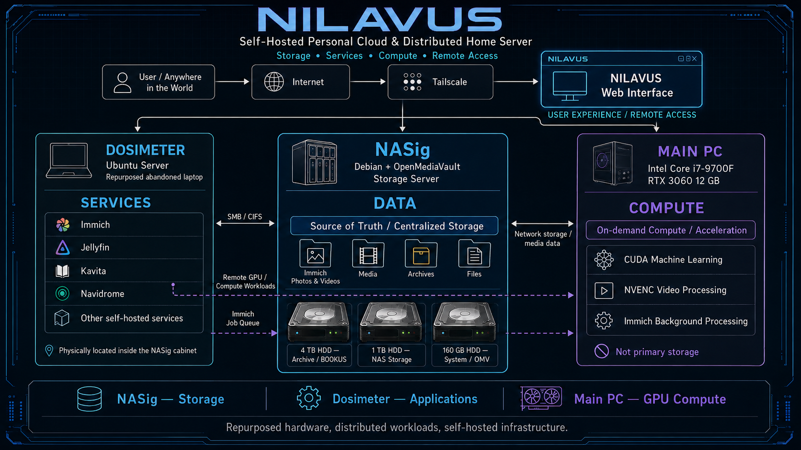
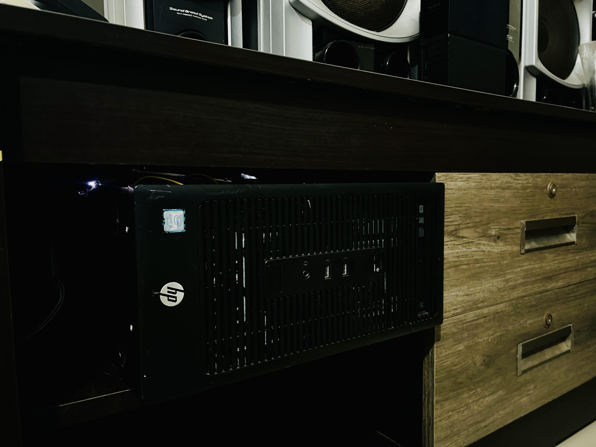
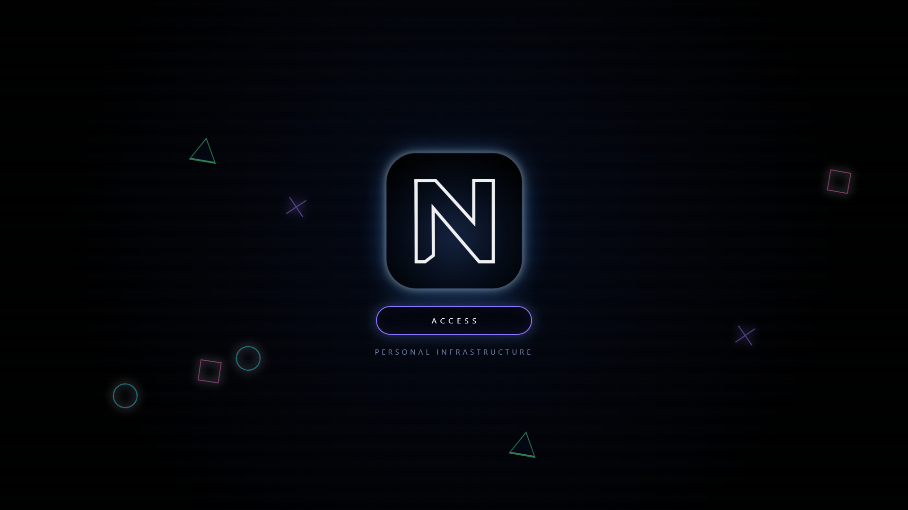
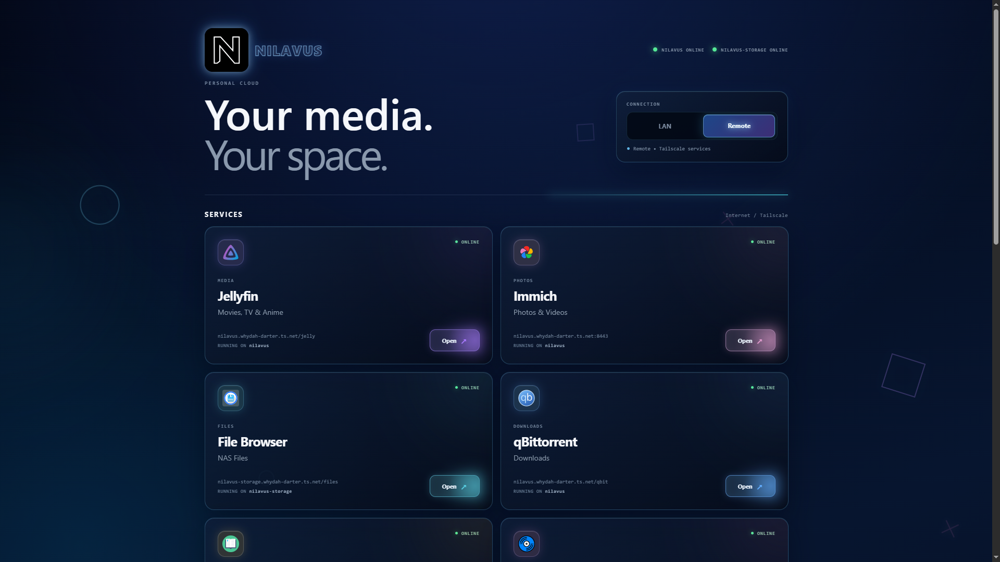
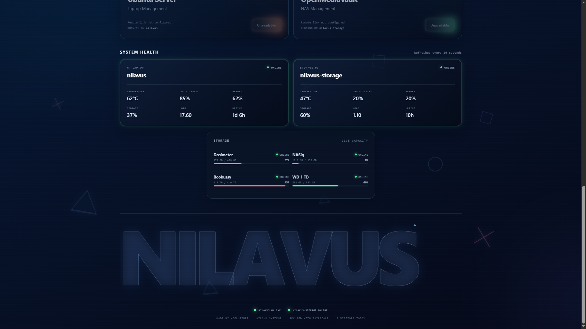

# NILAVUS

**Self-Hosted Personal Cloud & Distributed Home Server**

Storage • Services • Compute • Remote Access

[Open the NILAVUS dashboard](https://maxy747.github.io/NILAVUS/)

  

## Architecture

NILAVUS separates storage, applications, and compute across repurposed hardware:

- **NASig — Data:** Debian and OpenMediaVault provide the centralized source of truth across separate 4 TB, 1 TB, and 160 GB drives.
- **Dosimeter — Services:** an Ubuntu Server laptop runs Immich, Jellyfin, Kavita, Navidrome, and the rest of the application layer.
- **Main PC — Compute:** an Intel Core i7-9700F and RTX 3060 12 GB provide on-demand CUDA machine learning, NVENC video processing, and Immich background processing.
- **NILAVUS — User experience:** the web interface unifies service access locally and remotely through Tailscale.

Dosimeter accesses NASig over SMB/CIFS. The Main PC contributes compute when available, while primary media remains on NASig.

## The hardware

  
   
  The physical NILAVUS installation. The repurposed Dosimeter laptop and NASig storage system are housed together inside this cabinet.

## Interface showcase

<table>
  <tr>
    <td width="33%" align="center">
       
      PS2-inspired access screen
    </td>
    <td width="33%" align="center">
       
      Unified self-hosted services
    </td>
    <td width="33%" align="center">
       
      Live node and storage telemetry
    </td>
  </tr>
</table>

## Dashboard telemetry

- GitHub Pages serves the static dashboard.
- `nilavus` and `nilavus-storage` push a heartbeat every 30 seconds.
- Supabase marks a node offline after 90 seconds without a heartbeat.
- The visitor endpoint stores a daily salted hash; raw IP addresses are not stored.
- No service-role key or telemetry secret is included in the browser bundle or repository.

The existing Tailscale-hosted dashboard can remain active as a fallback during rollout.
